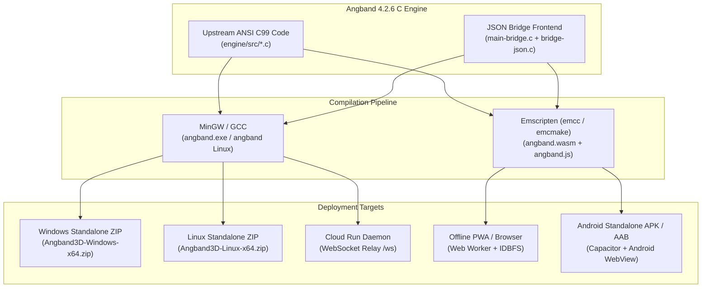
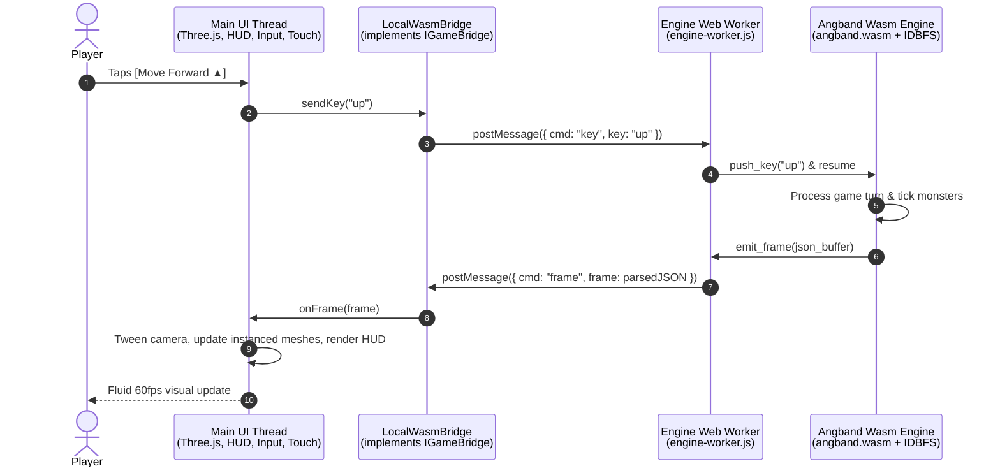

# Architectural Blueprint: Standalone Offline Android App & Universal WebAssembly Engine (Route A)

## 1. Executive Summary & Core Objective

The objective of **Route A** is to deliver a 100% standalone, offline-capable version of **Angband3D** that runs natively on Android devices (as an installable `.apk` / Google Play Store `.aab`) and in any modern web browser (as an offline Progressive Web App) **without requiring any cloud connectivity, background server, or active internet connection**.

All platforms—Windows standalone `.exe`, Linux standalone, Cloud Realm (`angband3d.com`), and Android `.apk`—will share **100% binary `.sav` save file compatibility**, allowing heroes to move seamlessly between mobile and desktop.



---

## 2. Technical Feasibility & Architectural Invariants

### 2.1 The C Engine: Zero System GUI Dependencies
Upstream Angband 4.2.6 is pure ANSI C99. The custom front end (`main-bridge.c`) uses standard POSIX C stdio:
- Emits JSON strings to an output stream (`stdout` or in-memory ring buffer).
- Reads single keypress command lines from an input stream (`stdin` or in-memory FIFO buffer).
- Has **zero dependencies on X11, Win32 GDI, DirectX, or curses** when built with `-DSUPPORT_BRIDGE_FRONTEND=ON`.

Because Emscripten provides a complete POSIX standard library (Musl libc) and virtual file system, compiling `angband` with the bridge frontend to WebAssembly (`angband.wasm`) is standard, deterministic, and adds 0 bytes of native assembly complexity.

### 2.2 Rebasability Invariant Guard
In strict accordance with `AGENTS.md` Rule 3:
- Upstream game mechanics, monster AI, dungeon generation, and RNG in `engine/` remain untouched.
- Wasm hooks and stream bindings are isolated to `engine/src/main-bridge.c` or an optional companion `engine/src/main-wasm.c`.
- The git diff re-export patch (`0001-bridge-frontend.patch`) remains clean.

---

## 3. WebAssembly Engine & Web Worker Architecture

### 3.1 The Concurrency Problem: Why Main Thread Wasm is Not Allowed
In Angband, the game loop blocks while waiting for user input (`bridge_pump()` waits on `fgets()`).
If WebAssembly were executed directly on the browser's main thread:
1. Blocking for input would freeze the JavaScript event loop.
2. The Three.js 60fps/120fps camera renderer, lighting animations, touch gestures, and D-pad clicks would instantly lock up.

### 3.2 The Solution: Dedicated Background Web Worker (`engine-worker.js`)
We run the WebAssembly engine inside a dedicated HTML5 Web Worker.



#### Advantages of the Web Worker:
1. **Buttery Smooth Rendering**: The Three.js render loop runs unhindered at the display's maximum refresh rate (60Hz / 90Hz / 120Hz ProMotion).
2. **Instant Input Response**: Touch events trigger visual haptic feedback immediately without waiting on engine calculations.
3. **Zero Latency**: Communication between the UI thread and Worker is local memory IPC (`postMessage` / `StructuredClone`), achieving sub-millisecond turn updates (0.1ms vs 30-80ms over WebSockets).

---

## 4. Dual-Driver Client Abstraction: `IGameBridge`

Currently, `server/public/js/network.js` manages WebSocket connections to the cloud server (`GameNetwork`). We will introduce a unified interface pattern so the entire rest of the frontend (`dungeon3d.js`, `hud.js`, `input.js`, `app.js`) is completely agnostic to whether it is running against the cloud or locally:

```typescript
interface IGameBridge {
    connect(charName: string, isNew: boolean, saveFile?: string): void;
    sendKey(key: string): void;
    sendText(text: string): void;
    saveGame(): void;
    quitGame(): void;
    
    // Callbacks
    onFrame: (frame: GameFrame) => void;
    onHello: (msg: HelloMessage) => void;
    onBye: (reason?: string) => void;
    onPing: (pingMs: number) => void;
    onStatus: (statusText: string) => void;
}
```

1. **`CloudBridge` (existing `GameNetwork`)**: Pipes commands through WebSocket to `wss://angband3d.com/ws`.
2. **`LocalWasmBridge` (new offline driver)**: Spawns `new Worker('js/engine-worker.js')` and routes identical JSON frames and keys via worker messaging.

Switching between Cloud Realm and Local Offline is a 1-line instantiation:
```javascript
const bridge = isOfflineMode ? new LocalWasmBridge() : new CloudBridge();
```

---

## 5. Storage Architecture & 100% Save Portability

### 5.1 Emscripten `IDBFS` (IndexedDB File System)
Angband saves characters using standard POSIX file operations (`fopen`, `fwrite`, `fclose`) into `lib/save/<CharName>.sav`.
- In Emscripten, we mount `/lib/save` using the built-in **`IDBFS`** (IndexedDB File System).
- When Angband writes a save, it writes to the in-memory virtual filesystem.
- Calling `FS.syncfs(false, callback)` asynchronously persists the raw binary bytes into browser IndexedDB (`/lib/save` store).
- On app launch, `FS.syncfs(true, callback)` populates the virtual directory from IndexedDB before starting Angband.

### 5.2 Universal `.sav` Transport: Exporting & Importing Anywhere
To fulfill the user requirement: *"I can move saves between any source and play on any device anywhere"*:

```
┌────────────────────────────────────────────────────────┐
│               HERO SAVE FILE MANAGER                   │
├────────────────────────────────────────────────────────┤
│  Local Characters in Storage:                          │
│                                                        │
│  🛡️ Conan (Level 18 Warrior)       [Play]  [📥 Export] │
│  ✨ Elrond (Level 12 Mage)          [Play]  [📥 Export] │
│                                                        │
├────────────────────────────────────────────────────────┤
│  [📤 Import Save File (.sav)]   [📥 Backup All Saves]  │
│  Drag & drop any Angband 4.2.6 save from PC or Cloud   │
└────────────────────────────────────────────────────────┘
```

1. **Exporting from Mobile/Offline to PC**:
   - Tapping **`[📥 Export]`** reads the raw `.sav` bytes directly from `IDBFS` / `FS.readFile()`, constructs a `Blob([bytes], { type: 'application/octet-stream' })`, and triggers a native download to the user's `Download/` folder or invokes the native Android Share sheet (Save to Drive / Files).
2. **Importing from PC/Cloud to Mobile**:
   - Tapping **`[📤 Import Save File]`** triggers a standard `<input type="file" accept=".sav">` (or Android Storage Access Framework picker).
   - Validates the `SaveVNLA` binary header.
   - Writes the bytes directly into `/lib/save/<Filename>.sav` and calls `FS.syncfs(false)`.
   - The character appears instantly in the load list!

---

## 6. Standalone Android App via Capacitor

### 6.1 Why Capacitor?
**Capacitor** (by Ionic) is the industry standard for packaging high-performance web applications into native Android and iOS apps:
- **Zero WebView Overhead**: Runs inside Google Chromium WebView with native WebGL 2.0 and WebAssembly JIT optimizations.
- **Pure Local Assets**: All HTML, CSS, JS, 3D models, audio files, and Wasm binaries reside locally in `android/app/src/main/assets/public/`. The app does **not** load remote web pages; it boots instantly from local disk with **0 network requests**.
- **Hardware Integration**: Provides native plugins for Android immersive fullscreen, hardware back-button intercept, and screen rotation locking.
- **Play Store Ready**: Generates a standard Gradle project that compiles into a signed `.apk` (for direct sideloading) and `.aab` (Android App Bundle for Google Play).

### 6.2 Android System Configuration (`AndroidManifest.xml` & `styles.xml`)
```xml
<!-- Fullscreen Immersive Mode: Hides Android Status Bar & Gesture Navigation -->
<activity
    android:name=".MainActivity"
    android:exported="true"
    android:theme="@style/AppTheme.NoActionBarLaunch"
    android:configChanges="orientation|keyboardHidden|keyboard|screenSize|locale|smallestScreenSize|screenLayout|uiMode"
    android:hardwareAccelerated="true"
    android:launchMode="singleTask">
</activity>
```

### 6.3 Hardware Back-Button Handling
On Android devices, pressing the physical or gesture Back button should not close the app:
1. If a modal or menu is open (Inventory, Store, Controls Guide, Pause Menu) -> Dismiss the modal (synthesizes `Esc`).
2. If in active 3D gameplay -> Open the in-game Pause Menu.
3. If at the Main Menu -> Prompt *"Exit Angband3D? (Yes/No)"*.

---

## 7. Risks, Challenges & Failure Mode Mitigations

| Risk / Challenge | Potential Impact | Architectural Mitigation |
|---|---|---|
| **1. Game Loop Freezing UI** | Angband's `fgets()` blocking call could freeze Three.js rendering | Run Wasm strictly inside an isolated Web Worker (`engine-worker.js`). UI thread communicates via asynchronous IPC. |
| **2. Storage Eviction on Android** | Android OS could potentially clear WebView storage under low disk space | 1. Use `navigator.storage.persist()` to request persistent storage.<br/>2. Add automated/one-tap **`[📥 Backup Save to Downloads]`** that writes `.sav` copies to Android public storage. |
| **3. Asset Loading in WebView (`file://` CORS issues)** | Local WebViews can block loading OBJ/GLTF models or Wasm via `file://` | Capacitor serves internal assets via `http://localhost` using a local Android `WebViewAssetLoader`, bypassing all file protocol CORS restrictions. |
| **4. Android Memory Consumption** | High-res textures or large meshes causing low-end phone crashes | 1. Angband3D uses instanced geometry and procedural stone shading with low draw calls.<br/>2. Wasm memory is pre-allocated with `-s INITIAL_MEMORY=32MB -s MAXIMUM_MEMORY=128MB`, well within Android budget. |
| **5. Screen Rotation & Notch Cutouts** | Display cutouts (camera punch holes) obscuring HUD elements | Use CSS `env(safe-area-inset-top)` and `env(safe-area-inset-left/right)`. Our HUD already isolates top bars with safe-area padding. |
| **6. Google Play Target API Policy** | Google requires all new apps to target Android 14+ (API 34/35) | Configure Gradle `compileSdkVersion 35` and `targetSdkVersion 35`. |

---

## 8. Universal Multi-Platform Hub ("Get Angband3D")

On `angband3d.com`, add a dedicated **`[⚔ Get Angband3D]`** modal that automatically detects the player's device and provides the appropriate offline options:

```
┌────────────────────────────────────────────────────────┐
│                   GET ANGBAND 3D                       │
├────────────────────────────────────────────────────────┤
│  Detected Platform: ANDROID PHONE                      │
│                                                        │
│  📱 Option 1: Install Web App (PWA)                    │
│     • One-tap install directly to your home screen     │
│     • Works 100% offline with local Wasm engine        │
│     • Zero storage clutter, instant launch             │
│     [📲 Install to Home Screen]                        │
│                                                        │
│  📦 Option 2: Download Standalone APK                  │
│     • Native Android Application package               │
│     • Full filesystem save import/export               │
│     [📥 Download Angband3D.apk (v1.1.4)]               │
│                                                        │
│  ────────────────────────────────────────────────────  │
│  Also Available For Other Devices:                     │
│  [🪟 Windows x64 .zip]  [🐧 Linux x64 .zip]            │
└────────────────────────────────────────────────────────┘
```

---

## 9. Phased Execution Roadmap

### Phase 1: WebAssembly Engine Build (`engine/`)
1. Create `tools/build-wasm.sh` / `tools/build-wasm.ps1` utilizing the Emscripten SDK (`emcc`).
2. Compile `engine/` into `server/public/wasm/angband.wasm` and `angband.js`, embedding gamedata (`lib/edit/`, `lib/pref/`, `lib/help/`).
3. Verify 11/11 smoke test parity in Node.js / headless browser.

### Phase 2: Offline Driver & Storage Integration (`server/public/`)
1. Implement `server/public/js/engine-worker.js` and `LocalWasmBridge` in `server/public/js/local_bridge.js`.
2. Connect `IDBFS` persistence for `/lib/save/`.
3. Add `[Play Offline (Local Wasm)]` button to the main menu and hero creation flow.
4. Implement `.sav` Export and Import file pickers.

### Phase 3: Android Capacitor Project & Build Automation
1. Initialize Capacitor in `client-mobile/` or root: `npx cap init Angband3D com.angband3d.game`.
2. Configure Android platform: `npx cap add android`.
3. Configure `AndroidManifest.xml` for immersive fullscreen, orientation handling, and back button.
4. Build debug APK and test on Android emulator / physical device.

### Phase 4: CI/CD & Automated GitHub Releases
1. Extend `.github/workflows/release.yml` to compile the Android APK using `gradlew assembleRelease`.
2. Attach `Angband3D-Android.apk` as a release asset alongside Windows and Linux ZIPs.
3. Deploy updated web client with PWA offline caching and download modal.
