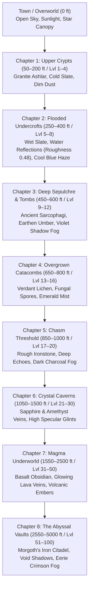

# High-Fidelity Depth Biome & Hybrid Creature Upgrade — Master Plan

## 1. Executive Summary & Core Mandate
This master plan details the complete architectural and visual overhaul of **Angband3D** to create an intensely rich, atmospheric first-person dark fantasy experience inspired by *Daggerfall*, *Dungeon Master*, and modern PBR crawlers.

### Core Mandates:
1. **Maximum Visual Richness & Immersion**:
   - Progressive 4-level depth chapters that dramatically evolve the dungeon's visual identity as the player descends.
   - Atmospheric depth fog that replaces the hardcoded pitch-black void with eerie, tinted subterranean haze.
   - 100% creature coverage using Shockbolt's canonical dark fantasy artwork with real-time torchlight normal maps, contact shadows, and breathing micro-animations.
2. **Unexposed Configuration (Clean UI)**:
   - **Zero user-facing graphics dropdowns or toggles** on the splash screen or HUD.
   - All configuration switches remain internal in code (`window.GRAPHICS_CONFIG`), running at maximum fidelity out-of-the-box, with transparent fallbacks.
3. **Rock-Solid Performance & Zero Regressions**:
   - 2048 × 2048 texture atlas (avoids the 8K WebGL crash on mobile devices).
   - Zero-allocation render loop (eliminates garbage-collection stutter).
   - `alphaTest: 0.25` with `depthWrite: true` (eliminates billboard depth-popping).
   - Full backward compatibility: existing 3D models (rats, spiders, snakes, wasps, imps, humanoids) and procedural fallbacks remain 100% operational.

---

## 2. Root Cause Analysis: Why Level 12 (600 ft) Looked Stagnant
A thorough forensic audit of `dungeon3d.js` revealed why Level 12 looked identical to Level 1:

| Root Cause | Code Location | What Happened | The Solution |
|---|---|---|---|
| **Coarse Depth Brackets** | `dungeon3d.js:865` | `if (depth <= 15)` grouped Levels 1–15 (50–750 ft) into one megazone. Level 12 was still in Zone 1. | Divide descent into **progressive 4-level chapters** (e.g. 1–4, 5–8, 9–12, 13–16). |
| **Hardcoded Black Fog** | `dungeon3d.js:2575` | `this.scene.fog.color.setHex(0x000000)` overwrote all biome fog colors with pure black. | Apply `biome.fogColor` to subterranean fog and background. |
| **Unnoticeable Color Tints** | `dungeon3d.js:867-870` | Sub-themes had <8% tint variation (`[0.85, 0.85, 0.88]`) over dark brick. | Apply bold, visible mineral undertones (sandstone ochre, damp slate, moss green, crystal azure). |
| **Ignored Torch Colors** | `dungeon3d.js:2520` | `biome.torchColor` was calculated but never assigned to `this.torchLight.color`. | Dynamically shift torch thermodynamic temperature per stratum. |
| **Missing Creature Art** | `dungeon3d.js:4754` | All non-humanoids (jellies, eyes, molds, wights, dragons) fell back to primitive cubes and spheres. | Deploy Shockbolt 2.5D illustrated billboards with normal maps. |

---

## 3. The 4-Level Progressive Depth Chapters
Instead of 15-level megazones where hours of play look identical, the dungeon evolves every 4 levels (~200 ft):



### Detailed Chapter Specifications:
1. **Chapter 1: Upper Crypts (Levels 1–4 / 50–200 ft)**
   - *Atmosphere*: Classic medieval stone crypts, weathered mortar, dry ashlar masonry.
   - *Wall/Floor Tint*: Clean granite grey (`wc: [0.82, 0.82, 0.84]`, `fc: [0.75, 0.75, 0.77]`).
   - *Fog*: Cold charcoal grey (`0x0c0e12`, near: 10, far: 24).
   - *Torch*: Warm candle-gold (`0xffdc99`, intensity: 2.4).
   - *PBR Roughness*: Floor 0.82, Wall 0.82.

2. **Chapter 2: Flooded Undercrofts (Levels 5–8 / 250–400 ft)**
   - *Atmosphere*: Waterlogged subterranean cellars with wet cobblestones and damp seepage.
   - *Wall/Floor Tint*: Wet slate blue-grey (`wc: [0.68, 0.74, 0.82]`, `fc: [0.58, 0.65, 0.74]`).
   - *Fog*: Damp aqua-marine haze (`0x060c12`, near: 8, far: 22).
   - *Torch*: Crisp flame (`0xffd485`, intensity: 2.6).
   - *PBR Roughness*: Floor **0.48** (high specular water sheen), Wall 0.72.

3. **Chapter 3: Deep Sepulchre & Tombs (Levels 9–12 / 450–600 ft — *Current User Depth*)**
   - *Atmosphere*: Ancient burial chambers, dusty sarcophagi, oppressive sepulchral silence.
   - *Wall/Floor Tint*: Weathered earthen sandstone (`wc: [0.88, 0.78, 0.65]`, `fc: [0.76, 0.68, 0.55]`).
   - *Fog*: Deep sepulchre violet-black (`0x0e0814`, near: 9, far: 23).
   - *Torch*: Deep amber firelight (`0xffc86a`, intensity: 2.8).
   - *PBR Roughness*: Floor 0.86, Wall 0.88 (dry, crumbling stone).

4. **Chapter 4: Overgrown Catacombs (Levels 13–16 / 650–800 ft)**
   - *Atmosphere*: Roots piercing the vaults, bioluminescent moss, damp loam, poisonous mold.
   - *Wall/Floor Tint*: Verdant lichen green (`wc: [0.65, 0.84, 0.62]`, `fc: [0.55, 0.74, 0.52]`).
   - *Fog*: Emerald fungal mist (`0x061408`, near: 8, far: 21).
   - *Torch*: Sickly pale-gold flame (`0xf6dfa0`, intensity: 2.7).
   - *PBR Roughness*: Floor 0.60, Wall 0.76.

---

## 4. The PBR Monster Billboard Pipeline

### Asset Source & Coverage
- **Source**: Raymond Gaustadnes's canonical **Shockbolt** tile suite bundled with Angband in `engine/lib/tiles/shockbolt/`.
- **Mapping**: `graf-shb-dark.prf` provides exact `0xRow:0xCol` coordinates for **all 624 named Angband monsters**.
- **Legal Status**: 100% free, open-source, and officially distributed with Angband.

### Texture Atlas Architecture (Mobile-Safe)
```
+-------------------------------------------------------------------+
|  Shockbolt 8192x2048 Source Sheet (64x64 tiles)                   |
+-------------------------------------------------------------------+
                                  │
                   [tools/build_monster_atlas.ps1]
                                  │
                                  ▼
+-----------------------------------+   +-----------------------------------+
| monster_atlas.png (2048 x 2048)   |   | monster_normal.png (2048 x 2048)  |
| 32 x 32 grid of 64x64 creatures   |   | Generated tangent normal maps     |
| 1px transparent gutter padding    |   | Sobel relief & spherical contour  |
| 100% WebGL mobile compatible      |   | Dynamic specular torchlight       |
+-----------------------------------+   +-----------------------------------+
                                  │
                                  ▼
+-------------------------------------------------------------------+
| monster_atlas.json (Fast UV lookup & physical heights)            |
| "Grey mold": { "uv": [u0, v0, u1, v1], "height": 0.65, "w": 0.65 }|
| "Baby red dragon": { "uv": [...], "height": 1.45, "w": 1.60 }     |
| "Morgoth": { "uv": [...], "height": 3.40, "w": 2.80 }             |
+-------------------------------------------------------------------+
```

### Visual Enhancements on Billboards:
1. **PBR Tangent Normal Maps**:
   - `material.normalMap = monsterNormalTexture`
   - Real-time `dot(N, L)` calculations react to the player's moving torchlight.
   - Scales, claws, ridges, and armor plates catch specular highlights and cast micro-shadows.
2. **Flawless Depth Sorting**:
   - `alphaTest: 0.25`, `depthWrite: true`, `transparent: false` (or tested cutout).
   - Discards transparent pixels in the fragment shader and writes directly to hardware Z-buffer.
   - Eliminates all popping, flickering, and sorting glitches when monsters overlap in corridors.
3. **Cylindrical Y-Billboarding**:
   - Monsters rotate strictly around the vertical Y-axis:
     $$\theta = \text{atan2}(x_{\text{cam}} - x_{\text{monster}},\, z_{\text{cam}} - z_{\text{monster}})$$
   - Feet stay locked flat and perpendicular to the cobblestones; no tilting when looking up or down.
4. **Soft Ground Contact Shadows**:
   - Elliptical shadow disc beneath creature feet at `y = 0.005`, scaled to footprint.
   - Eliminates the "floating paper doll" syndrome.
5. **Organic Volume-Conserving Breathing**:
   - Subtle idle sine cycle ($t \times 2.2$) expanding Y slightly while pinching X, keeping physical volume constant.
   - Sinusoidal hover for flying and ethereal monsters (eyes, bats, ghosts, wraiths, wasps).
6. **Biological Scale Hierarchy**:
   - Tiny (rats, snakes, worms): 0.45m &ndash; 0.65m
   - Small (kobolds, frogs, imps): 0.85m &ndash; 1.15m
   - Medium (orcs, elves, skeletons): 1.60m &ndash; 1.85m
   - Large (ogres, trolls, minotaurs): 2.10m &ndash; 2.50m
   - Colossal (hydras, ancient dragons, Morgoth): 2.80m &ndash; 3.60m

---

## 5. Non-Exposed Configuration (Zero UI Clutter)
- **Rule**: No dropdowns, radio buttons, or preset toggles added to the HUD, splash screen, or menus.
- **Implementation**:
  ```javascript
  window.GRAPHICS_CONFIG = {
      preset: 'enhanced',
      depthStrata: true,         // 4-level progressive biome chapters
      creatureRenderer: 'hybrid', // 3D models for rigged creatures, PBR billboards for rest
      normalMapping: true,        // Dynamic torchlight normal maps
      contactShadows: true,       // Grounding shadow discs
      idleBreathing: true,        // Organic volume breathing
      starrySky: true             // Celestial town canopy
  };
  ```
  The settings run at full fidelity by default. If we ever need to debug or disable a sub-feature, we can do so programmatically or via browser console.

---

## 6. Execution Roadmap & Verification Milestones

### Phase 1: Biome & Depth Strata Overhaul (Immediate Visual Transformation)
1. Update `getBiomeProfile(depth, levelSeed)` in `dungeon3d.js` with the 4-level progressive chapters.
2. Fix `updateDungeon`:
   - Assign `biome.fogColor` to `this.scene.fog.color` and `this.scene.background` in subterranean levels.
   - Update `this.torchLight.color` dynamically with `biome.torchColor`.
   - Modulate wall and floor material roughness (`this.floorMaterial.roughness`).
3. Verify at depth 0 (Town), depth 1 (50 ft), depth 6 (300 ft), and depth 12 (600 ft).

### Phase 2: Sprite Atlas & Normal Map Generation Tool
1. Create `tools/build_monster_atlas.ps1` using native PowerShell `System.Drawing`:
   - Parse `graf-shb-dark.prf` to map monster names and glyphs to `(row, col)`.
   - Crop 64x64 tiles with 1px gutter padding into `server/public/assets/sprites/monsters/monster_atlas.png` (2048x2048).
   - Generate `monster_normal.png` using 3x3 Sobel kernel + spherical silhouette gradient.
   - Emit `monster_atlas.json` with UV bounds and anatomical dimensions.

### Phase 3: Billboard Renderer Integration in `dungeon3d.js`
1. Load `monster_atlas.png`, `monster_normal.png`, and `monster_atlas.json`.
2. Construct shared single-quad geometry (`this.billboardGeo = new THREE.PlaneGeometry(1, 1)` with pivot at feet).
3. In `createCreatureMesh`:
   - If template exists in `this.monsterTemplates` (3D rat, spider, snake, frog, wasp, imp, humanoid) $\rightarrow$ render 3D model.
   - Else if monster in atlas $\rightarrow$ render PBR normal-mapped Y-billboard with ground contact shadow.
   - Else $\rightarrow$ fallback to procedural token.
4. Hook cylindrical Y-axis facing and volume-conserving breathing into `updateMonsters`.

### Phase 4: Automated Verification & Testing
1. Run smoke tests: `python tools/smoke_test.py` (11/11 tests passed).
2. Run server unit tests: `npm test` (20/20 test suites passed).
3. Run enhancements test: `node tools/test_graphics_enhancements.js` (8/8 invariants passed).
4. Run hybrid graphics suite: `node tools/test_hybrid_graphics.js` (7/7 invariants passed):
   - All 624 monster species and 49 glyphs mapped to valid UV bounds in [0, 1].
   - Anatomical scale heuristics verified (Farmer Maggot at 1.2m, baby dragons at 1.45m, Morgoth at 3.4m, eyes floating).
   - Mobile-safe 2048x2048 atlas and normal maps confirmed.
   - 4-level progressive depth chapters verified across Levels 1–20 and beyond.
   - Synchronized `computeTileShade` geological cluster formations verified.
   - Hybrid creature rendering with live auto-upgrade verified.
   - UI Cleanliness confirmed: zero graphics dropdowns or toggles in `index.html`.

---

## 7. Operational Invariants & Architecture Summary

```
                      +------------------------------------------+
                      |         Frame Ingest (updateDungeon)     |
                      +------------------------------------------+
                                           │
             ┌─────────────────────────────┴─────────────────────────────┐
             ▼                                                           ▼
+---------------------------+                               +---------------------------+
| Depth Chapter Resolution  |                               | Dynamic Lighting & Fog    |
| (Every 4 Levels / 200 ft) |                               | - biome.fogColor          |
| 1-4: Upper Crypts         |                               | - biome.torchColor        |
| 5-8: Flooded Undercrofts  |                               | - biome.floorRoughness    |
| 9-12: Deep Sepulchre      |                               | - biome.wallRoughness     |
| 13-16: Overgrown Catacomb |                               | - instanced tile shade    |
+---------------------------+                               +---------------------------+
             │                                                           │
             └─────────────────────────────┬─────────────────────────────┘
                                           ▼
                      +------------------------------------------+
                      |     Creature Rendering (createCreature)  |
                      +------------------------------------------+
                                           │
        ┌──────────────────────────────────┼──────────────────────────────────┐
        ▼                                  ▼                                  ▼
+---------------+                  +---------------+                  +---------------+
| Step 1: 3D    |                  | Step 2: PBR   |                  | Step 3:       |
| Models        | (Unmapped        | Normal-Mapped | (Atlas JSON      | Procedural    |
| (Rats, Spiders|  Creature)       | Billboard     |  pending/offline)| Geometric     |
|  Humanoids)   | ───────────────> | (Shockbolt    | ───────────────> | Tokens        |
|               |                  |  Atlas 2048)  |                  | (Fallback)    |
+---------------+                  +---------------+                  +---------------+
                                           │                                  │
                                           │ <── [Live Auto-Upgrade on Load] ─┘
                                           ▼
                      +------------------------------------------+
                      | Enhancements Applied:                    |
                      | - Cylindrical Y-Facing: atan2(dx, dz)    |
                      | - PBR Tangent Normal Map (dot(N, L))     |
                      | - Soft Ground Contact Shadow Disc        |
                      | - Volume-Conserving Breathing (t * 1.8)  |
                      | - Z-Buffer Cutout (alphaTest: 0.25)      |
                      +------------------------------------------+
```
