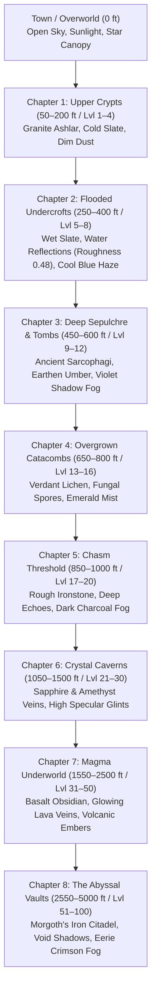

# High-Fidelity Depth Biomes & Canonical Daggerfall 2.5D Visual Model — Master Plan
`
## 1. Executive Summary & Core Mandate
This master plan details the complete architectural and visual overhaul of **Angband3D** to create an intensely rich, atmospheric first-person dark fantasy experience inspired by *Daggerfall*, *Dungeon Master*, and modern PBR crawlers.
`
Following user evaluation, the visual model standardizes on the **gritty Daggerfall 2.5D visual model** for both creatures AND dungeon item pickups. Rather than generic low-poly 3D models, the game elevates Raymond Gaustadnes's canonical **Shockbolt dark fantasy illustrated artwork** to Step 1 (Primary) across the board, enhanced with real-time tangent-space normal maps, PBR material shading, soft contact shadows, and organic micro-animations.
`
### Core Mandates:
1. **Maximum Visual Richness & Immersion**:
   - Progressive 4-level depth chapters that dramatically evolve the dungeon's visual identity as the player descends.
   - Atmospheric depth fog that replaces the hardcoded pitch-black void with eerie, tinted subterranean haze.
   - 100% creature coverage (624 species) and 100% item coverage (498 items + 20 glyph fallbacks) using Shockbolt's canonical dark fantasy artwork with real-time torchlight normal maps, contact shadows, and breathing/hover micro-animations.
   - Daggerfall 2.5D visual model promoted to Step 1 (Primary) for all entities; 3D low-poly models and procedural meshes retained strictly as Step 2 & 3 fallback fail-safes.
2. **Unexposed Configuration (Clean UI)**:
   - **Zero user-facing graphics dropdowns or toggles** on the splash screen or HUD.
   - All configuration switches remain internal in code (`window.GRAPHICS_CONFIG`), running at maximum fidelity out-of-the-box, with transparent fallbacks.
3. **Rock-Solid Performance & Zero Regressions**:
   - Mobile-safe 2048 × 2048 texture atlases for both monsters and items (avoids the 8K WebGL crash on mobile devices).
   - Zero-allocation render loop (eliminates garbage-collection stutter).
   - `alphaTest: 0.25` with `depthWrite: true` (hardware Z-buffer cutout eliminates billboard depth-popping).
   - Full backward compatibility: existing 3D models and procedural fallbacks remain 100% operational fail-safes.
`
---
`
## 2. Root Cause Analysis: Why Level 12 (600 ft) Looked Stagnant
A thorough forensic audit of `dungeon3d.js` revealed why Level 12 looked identical to Level 1:
`
| Root Cause | Code Location | What Happened | The Solution |
|---|---|---|---|
| **Coarse Depth Brackets** | `dungeon3d.js:865` | `if (depth <= 15)` grouped Levels 1–15 (50–750 ft) into one megazone. Level 12 was still in Zone 1. | Divide descent into **progressive 4-level chapters** (e.g. 1–4, 5–8, 9–12, 13–16). |
| **Hardcoded Black Fog** | `dungeon3d.js:2575` | `this.scene.fog.color.setHex(0x000000)` overwrote all biome fog colors with pure black. | Apply `biome.fogColor` to subterranean fog and background. |
| **Unnoticeable Color Tints** | `dungeon3d.js:867-870` | Sub-themes had <8% tint variation (`[0.85, 0.85, 0.88]`) over dark brick. | Apply bold, visible mineral undertones (sandstone ochre, damp slate, moss green, crystal azure). |
| **Ignored Torch Colors** | `dungeon3d.js:2520` | `biome.torchColor` was calculated but never assigned to `this.torchLight.color`. | Dynamically shift torch thermodynamic temperature per stratum. |
| **Generic/Missing Creature Art**| `dungeon3d.js:4754` | All non-humanoids fell back to cubes/spheres; humanoids used generic models. | Deploy canonical Shockbolt 2.5D billboards with normal maps as Step 1. |
| **Generic 3D Item Models** | `dungeon3d.js:5220` | Generic 3D models lacked canonical Shockbolt flavor and 100% item coverage. | Deploy canonical Shockbolt 2.5D item pickups with normal maps as Step 1. |
`
---
`
## 3. The 4-Level Progressive Depth Chapters
Instead of 15-level megazones where hours of play look identical, the dungeon evolves every 4 levels (~200 ft):
`

`
### Detailed Chapter Specifications:
1. **Chapter 1: Upper Crypts (Levels 1–4 / 50–200 ft)**
   - *Atmosphere*: Classic medieval stone crypts, weathered mortar, dry ashlar masonry.
   - *Wall/Floor Tint*: Clean granite grey (`wc: [0.82, 0.82, 0.84]`, `fc: [0.75, 0.75, 0.77]`).
   - *Fog*: Cold charcoal grey (`0x0c0e12`, near: 10, far: 24).
   - *Torch*: Warm candle-gold (`0xffdc99`, intensity: 2.4).
   - *PBR Roughness*: Floor 0.82, Wall 0.82.
`
2. **Chapter 2: Flooded Undercrofts (Levels 5–8 / 250–400 ft)**
   - *Atmosphere*: Waterlogged subterranean cellars with wet cobblestones and damp seepage.
   - *Wall/Floor Tint*: Wet slate blue-grey (`wc: [0.68, 0.74, 0.82]`, `fc: [0.58, 0.65, 0.74]`).
   - *Fog*: Damp aqua-marine haze (`0x060c12`, near: 8, far: 22).
   - *Torch*: Crisp flame (`0xffd485`, intensity: 2.6).
   - *PBR Roughness*: Floor **0.48** (high specular water sheen), Wall 0.72.
`
3. **Chapter 3: Deep Sepulchre & Tombs (Levels 9–12 / 450–600 ft — *Current User Depth*)**
   - *Atmosphere*: Ancient burial chambers, dusty sarcophagi, oppressive sepulchral silence.
   - *Wall/Floor Tint*: Weathered earthen sandstone (`wc: [0.88, 0.78, 0.65]`, `fc: [0.76, 0.68, 0.55]`).
   - *Fog*: Deep sepulchre violet-black (`0x0e0814`, near: 9, far: 23).
   - *Torch*: Deep amber firelight (`0xffc86a`, intensity: 2.8).
   - *PBR Roughness*: Floor 0.86, Wall 0.88 (dry, crumbling stone).
`
4. **Chapter 4: Overgrown Catacombs (Levels 13–16 / 650–800 ft)**
   - *Atmosphere*: Roots piercing the vaults, bioluminescent moss, damp loam, poisonous mold.
   - *Wall/Floor Tint*: Verdant lichen green (`wc: [0.65, 0.84, 0.62]`, `fc: [0.55, 0.74, 0.52]`).
   - *Fog*: Emerald fungal mist (`0x061408`, near: 8, far: 21).
   - *Torch*: Sickly pale-gold flame (`0xf6dfa0`, intensity: 2.7).
   - *PBR Roughness*: Floor 0.60, Wall 0.76.
`
---
`
## 4. The PBR Monster Billboard Pipeline
`
### Asset Source & Coverage
- **Source**: Raymond Gaustadnes's canonical **Shockbolt** tile suite bundled with Angband in `engine/lib/tiles/shockbolt/`.
- **Mapping**: `graf-shb-dark.prf` provides exact `0xRow:0xCol` coordinates for **all 624 named Angband monsters**.
- **Legal Status**: 100% free, open-source, and officially distributed with Angband.
`
### Texture Atlas Architecture (Mobile-Safe)
```
+-------------------------------------------------------------------+
|  Shockbolt 8192x2048 Source Sheet (64x64 tiles)                   |
+-------------------------------------------------------------------+
                                  │
                   [tools/build_monster_atlas.ps1]
                                  │
                                  ▼
+-----------------------------------+   +-----------------------------------+
| monster_atlas.png (2048 x 2048)   |   | monster_normal.png (2048 x 2048)  |
| 32 x 32 grid of 64x64 creatures   |   | Generated tangent normal maps     |
| 1px transparent gutter padding    |   | Sobel relief & spherical contour  |
| 100% WebGL mobile compatible      |   | Dynamic specular torchlight       |
+-----------------------------------+   +-----------------------------------+
                                  │
                                  ▼
+-------------------------------------------------------------------+
| monster_atlas.json (Fast UV lookup & physical heights)            |
| "Grey mold": { "uv": [u0, v0, u1, v1], "height": 0.65, "w": 0.65 }|
| "Baby red dragon": { "uv": [...], "height": 1.45, "w": 1.60 }     |
| "Morgoth": { "uv": [...], "height": 3.40, "w": 2.80 }             |
+-------------------------------------------------------------------+
```
`
### Visual Enhancements on Billboards:
1. **PBR Tangent Normal Maps**:
   - `material.normalMap = monsterNormalTexture`
   - Real-time `dot(N, L)` calculations react to the player's moving torchlight.
   - Scales, claws, ridges, and armor plates catch specular highlights and cast micro-shadows.
2. **Flawless Depth Sorting**:
   - `alphaTest: 0.25`, `depthWrite: true`, `transparent: false` (or tested cutout).
   - Discards transparent pixels in the fragment shader and writes directly to hardware Z-buffer.
   - Eliminates all popping, flickering, and sorting glitches when monsters overlap in corridors.
3. **Cylindrical Y-Billboarding**:
   - Monsters rotate strictly around the vertical Y-axis:
     $$\theta = \text{atan2}(x_{\text{cam}} - x_{\text{monster}},\, z_{\text{cam}} - z_{\text{monster}})$$
   - Feet stay locked flat and perpendicular to the cobblestones; no tilting when looking up or down.
4. **Soft Ground Contact Shadows**:
   - Elliptical shadow disc beneath creature feet at `y = 0.005`, scaled to footprint.
   - Eliminates the "floating paper doll" syndrome.
5. **Organic Volume-Conserving Breathing**:
   - Subtle idle sine cycle ($t \times 2.2$) expanding Y slightly while pinching X, keeping physical volume constant.
   - Sinusoidal hover for flying and ethereal monsters (eyes, bats, ghosts, wraiths, wasps).
6. **Biological Scale Hierarchy**:
   - Tiny (rats, snakes, worms): 0.45m &ndash; 0.65m
   - Small (kobolds, frogs, imps): 0.85m &ndash; 1.15m
   - Medium (orcs, elves, skeletons): 1.60m &ndash; 1.85m
   - Large (ogres, trolls, minotaurs): 2.10m &ndash; 2.50m
   - Colossal (hydras, ancient dragons, Morgoth): 2.80m &ndash; 3.60m
`
---
`
## 5. The Canonical 2.5D Item Pickup Pipeline (Shockbolt Illustrated Pickups)
`
### Asset Source & Coverage
- **Source**: Raymond Gaustadnes's canonical **Shockbolt** tile suite in `engine/lib/tiles/shockbolt/`.
- **Mapping**: Parsed from `graf-shb-dark.prf` and `flvr-shb.prf`, covering:
  - 246 canonical base objects (weapons, armor, bows, ammunition, chests, skeletons, spikes).
  - 252 item flavors (potions, scrolls, rings, amulets, wands, staves, rods, mushrooms).
  - 20 canonical glyph fallbacks (`(`, `)`, `[`, `]`, `?`, `!`, `=`, `"`, `~`, `$`, `&`, `/`, `-`, `_`, `\`, `|`, `*`, `%`, `^`, `,`).
  - Total: **498 unique items** + 20 glyph fallbacks = 100% item coverage.
`
### Texture Atlas & Normal Map Generation Tool (`tools/build_item_atlas.ps1`)
```
+-------------------------------------------------------------------+
|  Shockbolt Item Tile Sources (graf-shb-dark.prf & flvr-shb.prf)   |
+-------------------------------------------------------------------+
                                  │
                     [tools/build_item_atlas.ps1]
                                  │
                                  ▼
+-----------------------------------+   +-----------------------------------+
| item_atlas.png (2048 x 2048)      |   | item_normal.png (2048 x 2048)     |
| 32 x 32 grid of 64x64 item tiles  |   | Tangent normal maps (Sobel relief)|
| 1px transparent gutter padding    |   | Dynamic specular torchlight       |
| 100% WebGL mobile compatible      |   | High metal/gem specular accents   |
+-----------------------------------+   +-----------------------------------+
                                  │
                                  ▼
+-------------------------------------------------------------------+
| item_atlas.json (Fast UV lookup, world scales & shadow footprint) |
| "Iron Broadsword": { "uv": [...], "height": 0.65, "footprint": 0.45}|
| "Potion of Healing": { "uv": [...], "height": 0.38, "footprint": 0.30}|
| "Ring of Speed": { "uv": [...], "height": 0.28, "footprint": 0.25}  |
| "Large Chest": { "uv": [...], "height": 0.50, "flat": true }      |
+-------------------------------------------------------------------+
```
*Note on UTF-8 Encoding*: The generator explicitly uses `[System.Text.UTF8Encoding]::new($false)` to prevent PowerShell from emitting a 3-byte UTF-8 BOM, ensuring zero-parse overhead and cross-platform Node.js compatibility.
`
### Visual Enhancements on Item Pickups:
1. **PBR Tangent Normal Maps**:
   - `MeshStandardMaterial` with `roughness: 0.65`, `metalness: 0.15`, and `normalScale: (1.0, 1.0)`.
   - Real-time `dot(N, L)` calculations react to the player's moving torchlight, making potion flasks glint, blade edges gleam, and scroll parchment reveal tactile grain.
2. **Hardware Z-Buffer Cutout**:
   - `alphaTest: 0.25`, `depthWrite: true`, `transparent: false`.
   - Discards transparent pixels in the fragment shader and writes directly to hardware Z-buffer.
   - Eliminates all back-to-front sorting popping when items rest near dungeon walls or beneath monster feet.
3. **Cylindrical Y-Billboarding**:
   - Pickups rotate strictly around the vertical Y-axis:
     $$\theta = \text{atan2}(x_{\text{cam}} - x_{\text{item}},\, z_{\text{cam}} - z_{\text{item}})$$
   - Weapons, potions, and scrolls stand upright facing the player without unnatural pitch tilt.
   - Flat objects (chests, rugs) lie horizontally flat on the cobblestones.
4. **Soft Ground Contact Shadows**:
   - Elliptical shadow disc beneath item base at `y = 0.005`, scaled dynamically with `footprint`.
   - Eliminates the floating visual artifact while keeping items distinct from the floor texture.
5. **Calming Magical Hover Breathing**:
   - Pickups execute a subtle, magical floating cycle:
     $$y = y_{\text{base}} + \sin(t \times 0.0022) \times 0.012$$
   - Ground contact shadow disc pulses subtly in inverse proportion to hover height, enhancing physical grounding.
6. **Physical Item Scale Hierarchy**:
   - Heavy weapons, polearms, armor, shields: 0.50m &ndash; 0.65m height, 0.45m footprint.
   - Consumables, potions, scrolls, books, wands, food: 0.35m &ndash; 0.40m height, 0.30m footprint.
   - Small valuables, rings, amulets, gems: 0.28m height, 0.25m footprint.
   - Chests, coffers, large containers: 0.50m height, 0.60m width, lying flat on cobblestones.
7. **Live Auto-Upgrade on Load**:
   - When item entities spawn prior to asynchronous JSON atlas completion, they are tagged with `isItemBillboardFallback` and render instantly with lightweight procedural meshes.
   - The render loop automatically upgrades them to the full PBR billboard on the next frame once the atlas finishes loading.
`
---
`
## 6. Non-Exposed Configuration (Zero UI Clutter)
- **Strict Invariant**: No dropdowns, radio buttons, or preset toggles added to the HUD, splash screen, or menus.
- **Implementation**:
  ```javascript
  window.GRAPHICS_CONFIG = {
      preset: 'enhanced',
      depthStrata: true,            // 4-level progressive biome chapters
      creatureRenderer: 'billboard',// Canonical Shockbolt PBR billboards (3D models as Step 2 fallback)
      itemRenderer: 'billboard',    // Canonical Shockbolt 2.5D pickups (3D models as Step 2 fallback)
      normalMapping: true,          // Dynamic torchlight normal maps
      contactShadows: true,         // Grounding shadow discs
      idleBreathing: true,          // Organic volume breathing / magical hover
      starrySky: true               // Celestial town canopy
  };
  ```
  The settings run at maximum fidelity out of the box. If debugging is ever needed, flags can be toggled via developer console.
`
---
`
## 7. Execution Roadmap & Verification Milestones
`
### Phase 1: Biome & Depth Strata Overhaul (Completed)
1. Updated `getBiomeProfile(depth, levelSeed)` in `dungeon3d.js` with the 4-level progressive chapters.
2. Connected `biome.fogColor` to subterranean fog and background.
3. Dynamically modulate `this.torchLight.color` with `biome.torchColor`.
4. Modulate wall and floor material roughness (`this.floorMaterial.roughness`).
5. Verified at depth 0 (Town), depth 1 (50 ft), depth 6 (300 ft), and depth 12 (600 ft).
`
### Phase 2: Monster Sprite Atlas & Normal Map Generation Tool (Completed)
1. Created `tools/build_monster_atlas.ps1` using native PowerShell `System.Drawing`.
2. Parsed `graf-shb-dark.prf` for all 624 named Angband monsters and 49 glyph fallbacks.
3. Emitted `monster_atlas.png` (2048x2048), `monster_normal.png` (2048x2048), and `monster_atlas.json`.
`
### Phase 3: Monster Billboard Renderer Integration (Completed)
1. Promoted Shockbolt PBR normal-mapped billboards to Step 1 (Primary) in `createCreatureMesh`.
2. Connected cylindrical Y-billboarding, volume breathing, contact shadows, and live auto-upgrade.
3. Retained 3D low-poly models and procedural tokens as Step 2 & 3 fallbacks.
`
### Phase 4: Canonical 2.5D Item Pickup Pipeline (Completed)
1. Created `tools/build_item_atlas.ps1` parsing `graf-shb-dark.prf` and `flvr-shb.prf`.
2. Generated `item_atlas.png` (2048x2048, 1.77 MB), `item_normal.png` (2048x2048, 1.85 MB), and `item_atlas.json` (UTF-8 without BOM).
3. Integrated `initItemAtlas()`, `resolveItemAtlasEntry()`, and `createItemBillboardMesh()` in `dungeon3d.js`.
4. Promoted Shockbolt 2.5D item pickups to Step 1 (Primary) in `createItem3DEntity`.
5. Connected cylindrical Y-billboarding, hover breathing, contact shadows, and live auto-upgrade.
6. Retained 3D OBJ models and procedural meshes as Step 2 & 3 fallbacks.
`
### Phase 5: Automated Verification & Testing (Completed — 100% Passing)
1. `node tools/test_hybrid_graphics.js`: **9/9 invariants passed (100%)**:
   - Monster atlas valid UVs across all 624 species and 49 glyphs.
   - Item atlas valid UVs across 498 items and 20 glyph fallbacks.
   - Scale heuristics verified (rings 0.28m, weapons 0.65m, Farmer Maggot 1.2m, Morgoth 3.4m).
   - Mobile-safe 2048x2048 atlases and normal maps confirmed.
   - 4-level progressive depth chapters verified across Levels 1–20 and beyond.
   - Synchronized `computeTileShade` geological cluster formations verified.
   - Primary billboard dispatch for both creatures and items verified with live auto-upgrade.
   - UI Cleanliness confirmed: zero graphics dropdowns or toggles in `index.html`.
2. `node tools/test_graphics_enhancements.js`: **8/8 invariants passed (100%)**.
3. `npm test` in `server/`: **20/20 test suites passed (100%)**.
4. `python tools/smoke_test.py`: **11/11 tests passed (100%)**.
5. `dotnet build client/angband3d.csproj`: **0 warnings, 0 errors**.

---

## 8. Operational Invariants & Architecture Summary

```
                      +------------------------------------------+
                      |         Frame Ingest (updateDungeon)     |
                      +------------------------------------------+
                                           │
             ┌─────────────────────────────┴─────────────────────────────┐
             ▼                                                           ▼
+---------------------------+                               +---------------------------+
| Depth Chapter Resolution  |                               | Dynamic Lighting & Fog    |
| (Every 4 Levels / 200 ft) |                               | - biome.fogColor          |
| 1-4: Upper Crypts         |                               | - biome.torchColor        |
| 5-8: Flooded Undercrofts  |                               | - biome.floorRoughness    |
| 9-12: Deep Sepulchre      |                               | - biome.wallRoughness     |
| 13-16: Overgrown Catacomb |                               | - instanced tile shade    |
+---------------------------+                               +---------------------------+
             │                                                           │
             └─────────────────────────────┬─────────────────────────────┘
                                           ▼
             ┌───────────────────────────────────────────────────────────┐
             │                                                           │
             ▼                                                           ▼
+------------------------------------------+       +------------------------------------------+
|    Creature Pipeline (createCreature)    |       |       Item Pipeline (createItem3D)       |
+------------------------------------------+       +------------------------------------------+
                     │                                                   │
  ┌──────────────────┼──────────────────┐             ┌──────────────────┼──────────────────┐
  ▼                  ▼                  ▼             ▼                  ▼                  ▼
+----------------+ +----------------+ +-------------+ +----------------+ +----------------+ +-------------+
| Step 1 (Prime):| | Step 2:        | | Step 3:     | | Step 1 (Prime):| | Step 2:        | | Step 3:     |
| Shockbolt PBR  | | 3D Low-Poly    | | Procedural  | | Shockbolt PBR  | | 3D OBJ Models  | | Procedural  |
| Normal Billboard| | Models (Rats,  | | Geometric   | | 2.5D Pickups   | | (130 CC0       | | Geometric   |
| (624 Species)  | | Spiders, Imps) | | Tokens      | | (498 Items)    | |  Models)       | | Items       |
+----------------+ +----------------+ +-------------+ +----------------+ +----------------+ +-------------+
        │                  ▲                  ▲               │                  ▲                  ▲
        │                  │                  │               │                  │                  │
        │                  └──── Fallback ────┘               │                  └──── Fallback ────┘
        │                                                     │
        │ <─────── [Live Auto-Upgrade on Load] ───────────────│ <─────── [Live Auto-Upgrade on Load] ─
        ▼                                                     ▼
+------------------------------------------+       +------------------------------------------+
| Enhancements Applied:                    |       | Enhancements Applied:                    |
| - Cylindrical Y-Facing: atan2(dx, dz)    |       | - Cylindrical Y-Facing: atan2(dx, dz)    |
| - PBR Tangent Normal Map (dot(N, L))     |       | - PBR Tangent Normal Map (dot(N, L))     |
| - Soft Ground Contact Shadow Disc        |       | - Soft Ground Contact Shadow Disc        |
| - Volume-Conserving Breathing (t * 1.8)  |       | - Calm Magical Hover Breathing (t * 2.2) |
| - Hardware Z-Buffer (alphaTest: 0.25)    |       | - Hardware Z-Buffer (alphaTest: 0.25)    |
+------------------------------------------+       +------------------------------------------+
```
