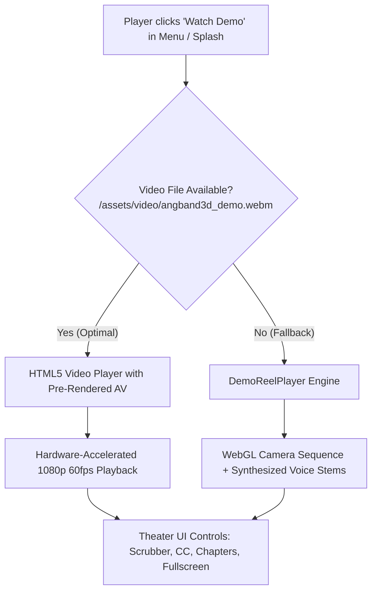

# Angband3D — Main Menu Gameplay Demo & Commercial Feature Plan
**A Broadcast-Quality Gameplay Trailer & Roguelike Veteran Feature Showcase**

---

## 1. Executive Summary & Creative Vision

### 1.1 The Objective
Build a dedicated **"🎬 Watch Gameplay Demo"** feature into the Splash Screen and Main Menu of `Angband3d.com` (and native clients). Clicking this option opens a broadcast-quality, YouTube-grade interactive theater experience that plays a 2.5-minute commercial and feature walkthrough. 

The presentation is explicitly tailored to **veterans of Angband and traditional roguelikes** (NetHack, DCSS, Moria, Brogue, ADOM). It directly confronts the psychological hurdles, skepticism, and muscle-memory traps that classic roguelike players face when encountering a 3D adaptation, while celebrating the game's uncompromising mechanical fidelity.

### 1.2 Creative Direction & Tone
- **Narrator**: Master Chronicler **Enceladus** — an expressive, theatrical, elder British bard whose voice combines dry wit, gravitas, and Tolkien-esque poetry.
- **Creature Voices**: Distinct character dialogue barks:
  - *Snerk the Snaga* (cunning, raspy goblin scout whispering in the shadows).
  - *Town Armourer* (hearty, booming dwarven merchant).
  - *Barrow Wight / Morgoth's Echo* (subterranean, reverberant ancient menace).
- **Soundscape**: 48kHz pristine studio audio with subterranean vault convolution reverb (10% wet), positional footsteps, clashing steel, crackling torchlight, and directional monster snores.
- **Pacing**: High energy, snappy 15–30 second vignettes with dynamic camera fly-throughs, kinetic typography on-screen callouts, side-by-side split screens, and dramatic sound design.

---

## 2. Veteran Gotchas & Key Selling Points

Classic roguelike players approach 3D conversions with deep suspicion ("Is this a dumbed-down hack-and-slash? Did they butcher the turn system? Is it real Angband?"). The commercial addresses these points head-on:

| # | Veteran Suspicion / Gotcha | Angband3D Reality & Feature Showcase |
|---|---|---|
| **1** | **"If I look around, will monsters get free turns to bash me?"** *(The #1 Veteran Fear)* | **0-Turn Camera Yaw**: Looking with mouse/touch takes **zero game turns**. Time completely freezes. Monsters only move when you step, strike, cast, or rest. |
| **2** | **"Where is my ASCII grid? I have 20 years of muscle memory reading `@` and `d`."** | **Instant Dual Reality (`Tab`)**: Tap `Tab` at any millisecond to view the bit-for-bit 80x24 Angband 4.2.6 terminal with camera orientation markers and instant return to 3D. |
| **3** | **"In 2D I see the whole room; in 3D I'm blind around corners."** | **Claustrophobic Darkness & HRTF Spatial Audio**: True physically modeled torchlight radius, plus 3D binaural hearing to detect snoring orcs and scuttling spiders before line of sight. |
| **4** | **"Is this an altered clone with simplified mechanics?"** | **Authoritative 4.2.6 C Engine**: Unaltered upstream Angband 4.2.6 C code running in WebAssembly / native process. Zero modified RNG or stat formulas. |
| **5** | **"Will my progress be trapped in a browser tab?"** | **100% Universal Save Files (`SaveVNLA`)**: Seamlessly export `.sav` files from `angband3d.com` and load them into the Android APK, Windows PC client, or vanilla Linux Angband! |
| **6** | **"How do I keep track of what happened when everything is 3D?"** | **The Living Chronicle & Voiced Lorekeeper**: Real-time Tolkien-style illuminated chronicle with neural voice acting recording your triumphs and tragic deaths. |

---

## 3. Scene-by-Scene Script & Storyboard (Duration: 2:45)

```mermaid
timeline
    title 2:45 Commercial Showcase Timeline
    0:00 - 0:25 : Act I - The Awakening (Town & 0-Turn Yaw)
    0:25 - 0:55 : Act II - Claustrophobic Descent (Torchlight & Gotcha #1)
    0:55 - 1:25 : Act III - The Dual Reality (Instant Tab & ASCII Terminal)
    1:25 - 1:55 : Act IV - Spatial Stealth (HRTF Audio & Blind Corners)
    1:55 - 2:20 : Act V - Tactical Vault Combat (Weapons & Escapes)
    2:20 - 2:35 : Act VI - The Living Chronicle (Voiced Tome & Lore)
    2:35 - 2:45 : Act VII - Universal Call to Action (Web, PC, Android)
```

---

### Act I: The Awakening — Town of Angband (0:00 – 0:25)
- **Visual**: Slow, cinematic camera glide down the cobblestones of the Town. Sunlight glints off timbered shopfronts. A player character in chainmail with a broadsword walks toward the Armoury. The camera smoothly pans 360° across the buildings while the shopkeeper stands frozen mid-hammer strike.
- **On-Screen Kinetic Text**: `ANGBAND 4.2.6 • FIRST-PERSON 3D`
- **SFX**: Town bells tolling softly, crisp outdoor boots on stone, anvil hammer strike.
- **Narrator (Enceladus)**:
  > *"For thirty years, you mapped the pits of Morgoth through strings of green text on an eighty-column screen. You memorized every glyph, every stat, every cruel, unforgiving demise. Welcome back to Angband... but open your eyes."*
- **Town Merchant (Bark)**:
  > *"Ah, another brave fool seeking glory below! Mind your torches, stranger!"*

---

### Act II: The First Descent & Gotcha #1 — 0-Turn Camera Yaw (0:25 – 0:55)
- **Visual**: Transition down dungeon stairs into 50ft Crypts. Pitch-black stone hallway illuminated only by the warm, flickering circle of a brass lantern. A Cave Spider crawls along the ceiling ahead. 
  - The camera aggressively whips left, right, and up at the ceiling. 
  - A giant on-screen visual overlay highlights the Turn Counter: `GAME TURN: 1420 (FROZEN)`. 
  - The spider remains completely paused in mid-crawl.
- **On-Screen Kinetic Text**: `GOTCHA #1: TURNING YAW = 0 GAME TURNS • TIME FREEZES`
- **SFX**: Sizzling lantern wick, sudden quiet subterranean room tone.
- **Narrator (Enceladus)**:
  > *"Rule number one for the veteran: looking around will not get you killed. Camera yaw costs precisely zero turns. Pan the darkness, inspect every shadow, check the ceiling for spiders—the world moves only when you take a step."*
- **Visual (Action)**: The player takes one step forward (`ArrowUp`). The spider lunges! The player raises a heater shield with a metallic clang and strikes back.
- **SFX**: Spider hiss, heavy wooden shield block, sword slash.

---

### Act III: The Dual Reality — Instant ASCII Terminal (0:55 – 1:25)
- **Visual**: Fast-paced split-screen / morph transition. The 3D corridor instantly flips into the exact classic 80x24 Angband terminal. An `@` symbol stands in a doorway surrounded by `#` walls and `s` glyphs. 
  - An orange directional arrow shows which way the 3D camera is facing.
  - The player hits `i` to inspect inventory, rolls through classic lettered menus, and hits `Tab` to seamlessly snap back into full 3D first-person view.
- **On-Screen Kinetic Text**: `PRESS [TAB] ANYTIME • GENUINE 80x24 ANGBAND 4.2.6 TERMINAL`
- **Narrator (Enceladus)**:
  > *"Miss your glyphs? Fear losing your classic overview? Press Tab. Instantaneous, bit-for-bit Angband 4.2.6 terminal mode. Same menus, same inventory hotkeys, zero compromise. The 3D world and the ASCII matrix are one and the same."*

---

### Act IV: Spatial Stealth & Binaural HRTF Audio (1:25 – 1:55)
- **Visual**: Depth 250ft. Labyrinthine corridor with sharp 90-degree blind corners. The player pauses in darkness and extinguishes their lantern to avoid detection.
  - 3D soundwave rings ripple from around the corner on the left side of the screen.
  - Directional audio prompt: `[HRTF: Snoring Orc Scout (Left, 4 paces)]`.
  - Infravision kicks in: an ethereal misty red silhouette appears through the gloom.
- **On-Screen Kinetic Text**: `3D SPATIAL HRTF AUDIO • STEALTH & INFRAVISION`
- **SFX**: Low rumbling subterranean snore panned hard left in stereo/headphones.
- **Snerk the Snaga (Whisper/Grumble)**:
  > *"Hssst... quiet in the dark... the man-thing smells of iron and lamp oil..."*
- **Narrator (Enceladus)**:
  > *"In 3D, corridors are narrow and corners are blind. But you have ears. 3D spatial audio lets you hear snoring orcs and skittering vermin around the bend before you walk into their line of sight."*

---

### Act V: Vault Breach, Viewmodels & Tactical Survival (1:55 – 2:20)
- **Visual**: Depth 1000ft. Massive carved vault door creaks open. Inside: glowing treasure heaps, magical wands, and a slumbering Young Red Dragon surrounded by Fire Hounds.
  - The player equips a glowing Claymore of Westernesse (first-person 3D viewmodel hands with race-scaled gauntlets).
  - The dragon wakes with a fiery roar! Fire breath fills the chamber.
  - Player instantly reads a Scroll of Phase Door: *WHOOSH*—teleporting into a side corridor just in time.
  - Player quaffs a Potion of Speed and casts Lightning Bolt, illuminating the hall in blinding electric blue.
- **On-Screen Kinetic Text**: `AUTHENTIC COMBAT • 3D VIEWMODELS • NO ALTERED MECHANICS`
- **SFX**: Vault door grinding stone, dragon roar, phase door chime, crackling lightning blast.
- **Dragon / Ancient Menace (Roar)**:
  > *"Who dares disturb the hoard of the deep?!"*
- **Narrator (Enceladus)**:
  > *"Every item, every spell, every resistance from the 4.2.6 compendium is here. No cooldowns, no action-game shortcuts. Turn-based tactical roguelike survival, exactly as Tolkien and the Devteam intended."*

---

### Act VI: The Living Chronicle & Voiced Lorekeeper (2:20 – 2:35)
- **Visual**: The illuminated Adventure Tome opens smoothly over the dungeon view. Old parchment pages fill with Gothic calligraphy describing the dragon encounter in poetic Westmarch prose. 
  - Audio waveform equalizer pulses as the Chronicle's master bard speaks.
  - Subterranean reverb creates a cathedral-like acoustic resonance.
- **On-Screen Kinetic Text**: `THE LIVING CHRONICLE • GENERATIVE SAGAS & VOICED BARD`
- **Narrator (Enceladus)**:
  > *"Every step of your pilgrimage is penned in real time into the Living Chronicle—voiced as an epic saga, preserving your glorious victories and your most humiliating blunders for eternity."*

---

### Act VII: Universal Freedom & Call to Action (2:35 – 2:45)
- **Visual**: Montage of platforms: Web browser on laptop, Android phone with tactile touch d-pad, and Windows desktop client running at 144 FPS. 
  - An animation highlights a `.sav` file flowing seamlessly between device icons.
- **On-Screen Kinetic Text**: `PLAY FREE IN BROWSER • WINDOWS PC • ANDROID APK`
- **On-Screen Kinetic Text**: `100% UNIVERSAL SAVE COMPATIBILITY`
- **Narrator (Enceladus)**:
  > *"Play instantly in your browser, or take it offline with standalone Windows and Android clients. Your save files are universal. Angband 3D awaits. Descend if you dare."*
- **Closing Card**: 
  - Huge Angband3D Logo.
  - `[ PLAY FREE NOW ]` button with keyboard prompt `[PRESS ENTER]`.

---

## 4. Technical Architecture: YouTube-Grade Theater Player

### 4.1 Player Specifications
To deliver on the promise of *"watch it just as good as we would see it on youtube"*, the modal player requires:
1. **Responsive 16:9 Cinematic Stage**:
   - Fluid sizing up to 1080p (1920x1080) with true cinema letterboxing and subtle ambient light bleed (matching YouTube's "Ambient Mode").
2. **Glassmorphic Transport Bar**:
   - Smooth seek bar with hover timestamp thumbnail tooltip and buffer bar.
   - Interactive chapter marker ticks along the timeline.
   - Play/Pause toggle with large central splash play icon on idle/pause.
   - Timecode display (`0:42 / 2:45`).
   - Closed Captions toggle (`[CC]`) with styled cinematic subtitles.
   - Volume slider with mute button.
   - Fullscreen button (`[⛶]`) supporting HTML5 Fullscreen API.
   - Direct CTA button: **"⚔ Jump In & Play [Enter]"**.
3. **Chapter Navigation Drawer / Ribbon**:
   - Quick jump pills beneath the video:
     - `0:00` Awakening
     - `0:25` 0-Turn Yaw
     - `0:55` ASCII Terminal
     - `1:25` Spatial Stealth
     - `1:55` Vault Combat
     - `2:20` Living Tome
     - `2:35` Get Started

---

### 4.2 Delivery Pipeline: Hybrid Video & Engine Fallback



1. **Primary Track (Production Video)**:
   - Encoded as high-efficiency WebM (VP9/Opus) and MP4 (H.264/AAC) at 1080p 60fps (~25MB for 2.5 minutes).
   - Served statically by Express with HTTP `Range` request support for instant seeking and zero buffering stalls.
2. **Interactive Audio Stems (Pre-buffered Audio)**:
   - Voice narration and character dialogue clips generated in advance using the Gemini Native Audio / Edge TTS Enceladus pipeline (`/api/tts`).
   - Stored statically in `/server/public/assets/audio/demo/` for instant loading without hitting API rate limits or incurring cloud TTS costs during playback.
3. **Automated Fallback Player (`demo-reel.js`)**:
   - If the pre-rendered video is not yet downloaded or in low-bandwidth offline scenarios, an automated script orchestrates the Three.js viewport, switches between dungeon depths, spawns 3D monsters, triggers weapon animations, and plays the audio stems in exact sync.

---

## 5. UI Integration & DOM Structure

### 5.1 Main Menu Option
Add option `[9] 🎬 Gameplay Demo & Showcase` to `#main-menu-options`:
```html
<button class="menu-option-btn" id="btn-menu-demo" data-index="8">
    <span class="menu-bullet">►</span>
    <span class="menu-num">[9]</span>
    <div class="menu-text-col">
        <span class="menu-label">🎬 Gameplay Demo &amp; Feature Showcase</span>
        <span class="menu-desc">Watch a 2-minute narrated commercial highlighting 0-turn yaw, ASCII terminal, and gotchas.</span>
    </div>
</button>
```

### 5.2 Splash Screen Shortcut
Add `[D] 🎬 Watch Demo` to `.splash-shortcuts`:
```html
<button class="splash-shortcut-btn" id="btn-splash-demo"><kbd>[D]</kbd> 🎬 Gameplay Demo</button>
```

### 5.3 Dedicated Theater Modal (`#demo-modal`)
```html
<!-- Gameplay Demo & Commercial Showcase Modal -->
<div id="demo-modal" class="hidden">
    <div class="demo-backdrop"></div>
    <div class="demo-theater-container">
        <!-- Close Button -->
        <button id="btn-demo-close" class="demo-close-btn" title="Close Demo (Esc)">✕</button>

        <!-- Ambient Video Glow Layer (YouTube Ambient Mode Effect) -->
        <div class="demo-ambient-glow" id="demo-ambient-glow"></div>

        <!-- 16:9 Cinema Container -->
        <div class="demo-video-wrapper">
            <video id="demo-video-player" playsinline preload="metadata">
                <source src="/assets/video/angband3d_demo.webm" type="video/webm">
                <source src="/assets/video/angband3d_demo.mp4" type="video/mp4">
            </video>

            <!-- Subtitle / Closed Caption Overlay -->
            <div id="demo-captions-overlay" class="demo-captions-overlay"></div>

            <!-- Big Center Play Button Overlay -->
            <button id="demo-center-play" class="demo-center-play" title="Play Video">
                <svg viewBox="0 0 24 24" class="play-icon"><path d="M8 5v14l11-7z" fill="currentColor"/></svg>
            </button>

            <!-- Custom Glassmorphic Transport Controls -->
            <div class="demo-transport-bar" id="demo-transport-bar">
                <!-- Timeline Scrubber with Chapter Pips -->
                <div class="demo-scrubber-track" id="demo-scrubber-track">
                    <div class="demo-scrubber-buffer" id="demo-scrubber-buffer"></div>
                    <div class="demo-scrubber-progress" id="demo-scrubber-progress"></div>
                    <div class="demo-scrubber-handle" id="demo-scrubber-handle"></div>
                    <div class="demo-chapter-pips" id="demo-chapter-pips"></div>
                    <div class="demo-scrubber-tooltip" id="demo-scrubber-tooltip">00:00</div>
                </div>

                <!-- Lower Controls Row -->
                <div class="demo-controls-row">
                    <div class="demo-controls-left">
                        <button id="demo-btn-play" class="demo-ctrl-btn" title="Play/Pause (Space)">▶</button>
                        <button id="demo-btn-replay" class="demo-ctrl-btn" title="Replay from Start">↺</button>
                        <div class="demo-volume-group">
                            <button id="demo-btn-mute" class="demo-ctrl-btn" title="Mute/Unmute (M)">🔊</button>
                            <input type="range" id="demo-volume-slider" min="0" max="100" value="80" class="demo-slider">
                        </div>
                        <span id="demo-timecode" class="demo-timecode">0:00 / 2:45</span>
                    </div>

                    <div class="demo-controls-right">
                        <button id="demo-btn-cc" class="demo-ctrl-btn active" title="Subtitles / Captions (C)">[CC]</button>
                        <button id="demo-btn-fullscreen" class="demo-ctrl-btn" title="Toggle Fullscreen (F)">⛶</button>
                        <button id="demo-btn-play-game" class="demo-btn-play-game btn-gold">⚔ Jump In &amp; Play</button>
                    </div>
                </div>
            </div>
        </div>

        <!-- Chapter Jump Ribbon -->
        <div class="demo-chapter-ribbon">
            <button class="demo-chapter-pill active" data-time="0">✨ Awakening</button>
            <button class="demo-chapter-pill" data-time="25">👀 0-Turn Yaw</button>
            <button class="demo-chapter-pill" data-time="55">⌨ [Tab] ASCII Terminal</button>
            <button class="demo-chapter-pill" data-time="85">🎧 Spatial 3D Audio</button>
            <button class="demo-chapter-pill" data-time="115">⚔ Vault Combat</button>
            <button class="demo-chapter-pill" data-time="140">📖 Living Chronicle</button>
            <button class="demo-chapter-pill" data-time="155">🚀 Platforms &amp; Saves</button>
        </div>
    </div>
</div>
```

---

## 6. Complete Implementation Steps

### Phase 1: Narration & Dialogue Audio Assets
1. **Audio Synthesis Script (`tools/generate_demo_audio.js`)**:
   - Script that calls the server-side Gemini Native Audio engine for Enceladus and Edge TTS for creature barks.
   - Generates 14 high-bitrate MP3/WAV narration clips:
     - `demo_01_intro.mp3` ("For thirty years, you mapped the pits of Morgoth...")
     - `demo_02_merchant.mp3` ("Ah, another brave fool seeking glory below!")
     - `demo_03_gotcha_yaw.mp3` ("Rule number one for the veteran: looking around will not get you killed...")
     - `demo_04_ascii_tab.mp3` ("Miss your glyphs? Press Tab...")
     - `demo_05_spatial_audio.mp3` ("In 3D, corridors are narrow and corners are blind...")
     - `demo_06_goblin_snore.mp3` ("Hssst... quiet in the dark...")
     - `demo_07_vault_combat.mp3` ("Every item, every spell from 4.2.6 is here...")
     - `demo_08_dragon_roar.mp3` ("Who dares disturb the hoard of the deep?!")
     - `demo_09_chronicle_tome.mp3` ("Every step is penned into the Living Chronicle...")
     - `demo_10_call_to_action.mp3` ("Play instantly in your browser, or take it offline...")
   - Combines clips with ambient background music and sound effects into a master soundtrack:
     - `/assets/audio/demo/demo_master_soundtrack.mp3`.

### Phase 2: Video Capture & Encoding Pipeline
1. **Gameplay Footage Assembly**:
   - Snippets captured across 4 distinct dungeon environments:
     - Depth 0: Town with cobblestones, timber houses, and shops.
     - Depth 1 (50ft): Crypts, torchlight, spiders, skeleton warriors.
     - Depth 5 (250ft): Labyrinthine stone corridors, sleeping orcs, HRTF stealth.
     - Depth 20 (1000ft): Massive dragon vault, Westernesse claymore, phase door escape.
   - Dual-reality showcase: 3D to 80x24 terminal instant switch.
2. **Video Compilation**:
   - Master trailer encoded to `/server/public/assets/video/angband3d_demo.webm` (VP9) and `.mp4` (H.264).
   - Optimized for fast progressive web streaming with fast-start MOOV atom flag.

### Phase 3: Theater UI & Player Controller (`server/public/js/demo-player.js`)
1. Create `DemoPlayer` module encapsulating:
   - Full playback state machine (Idle, Loading, Playing, Paused, Seeking, Ended).
   - Custom scrubber physics with hover preview times and drag seeking.
   - Web Audio sync: binds video volume to master audio settings.
   - Subtitle engine: displays timed text overlays matching narration timestamps.
   - Ambient mode: samples video frame colors and paints a soft blurred glow around the theater stage.
   - Keyboard shortcuts:
     - `Space` / `K`: Play / Pause.
     - `Left` / `Right`: Seek -5s / +5s.
     - `M`: Mute / Unmute.
     - `F`: Toggle Fullscreen.
     - `C`: Toggle Subtitles.
     - `Esc`: Close Theater and return to Main Menu.
     - `Enter`: Jump into game immediately.

### Phase 4: Main Menu & Splash Screen Integration
1. **HTML Markup (`server/public/index.html`)**:
   - Insert `#demo-modal`.
   - Add `#btn-splash-demo` to Splash shortcuts (`[D]`).
   - Add `#btn-menu-demo` as option `[9]` in Main Menu.
2. **CSS Styling (`server/public/css/dungeon.css`)**:
   - Cinematic modal layout, glassmorphic transport styling, gold borders, glow highlights.
3. **App State Coordinator (`server/public/js/app.js`)**:
   - Add `appState = 'demoModal'`.
   - Implement `showDemo(fromState)` and `hideDemo()`.
   - Pause in-game audio/music when the demo plays; restore when closed.
4. **Input Handler (`server/public/js/input.js`)**:
   - Support `[D]` hotkey on splash screen to launch demo.
   - Support `[9]` on main menu to launch demo.
   - When in `appState === 'demoModal'`, route keys to `DemoPlayer`.

### Phase 5: Automated Testing & Verification
1. **Unit & Integration Tests (`tools/test_demo_player.js`)**:
   - Verify modal DOM injection, keyboard navigation, chapter seek timestamps, and closed caption sync.
2. **Server Range Request & Video Streaming Test (`server/test/server_test.js`)**:
   - Verify HTTP 206 Partial Content support for `/assets/video/angband3d_demo.*`.
3. **Live Cloud Run Deployment**:
   - Build, push, and verify live on `https://angband3d.com`.

---

## 7. Immediate Next Steps & Deliverables

Once this plan is reviewed and approved:
1. Generate the master narration audio stems and synchronized subtitles.
2. Build the `#demo-modal` and `DemoPlayer` controller.
3. Hook up the Main Menu option `[9]` and Splash Screen `[D]`.
4. Assemble and verify the gameplay footage clips and video streams.
5. Deploy and verify live on `angband3d.com`.
